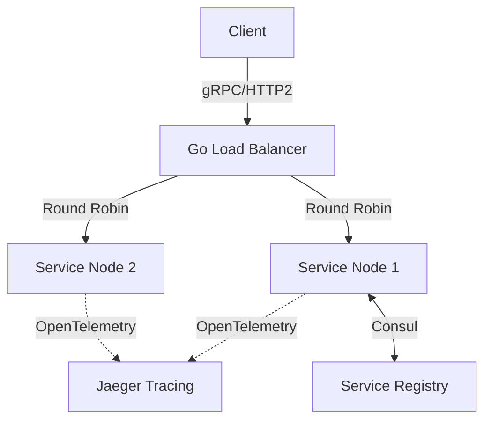

# Go-Concurrent-Crawler


A high-throughput, bounded-concurrency web crawling engine using Go channels, WaitGroups, and semaphore patterns to prevent resource exhaustion.

## System Architecture





## Elite Features
- **Semaphore Pattern**: Bounded worker pool using buffered channels.
- **Context Cancellation**: Timeout and cancellation propagation across all goroutines.
- **Thread-Safe Deduplication**: `sync.Map` for lock-free URL visited tracking.

## Quick Start
```bash
go mod tidy
go test ./...
go run main.go
```
